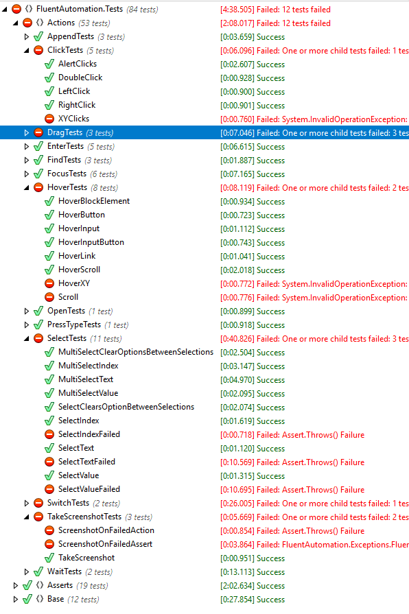

## FluentAutomation API - Simple Fluent API for UI Automation

Please post ideas and new functionality that you'd like to see on our new UserVoice site: [http://fluentapi.uservoice.com](http://fluentapi.uservoice.com)

Visit our public site at [http://fluent.stirno.com](http://fluent.stirno.com) orfollow [@stirno](http://twitter.com/intent/user?screen_name=stirno) on Twitter.

### Building the solution and running the unit tests

1. run `update-chrome-driver.ps1` to download and unpack (unzip) the latest chrome driver.
1. make sure chromedriver is in your system path. *(not 100% certain this is required as the chromedriver is an embedded resource in the project?)*
1. ?? not sure... need to test, disable chrome script debugging
1. build the solution
1. right click on the test project `FluentAutomation.TestApplication` and select `View -> in browser`. This will start iisexpress.
1. Run or debug any unit test you want to.

### current status of this (Alan's) fork (not yet ready for pull request)

- 72 passing tests, and 12 failing. I have not yet started digging in to why they're failing, whether it's timing with new chrome updates, or the new chrome javascript debugging. For now I wanted to get this up as soon as possible since I have a significant project that relies heavily on FA.
- I'll be looking in the failing tests tomorrow, below is the results so far, all the really critical items appear to be working;

**what appears to still be broken with my (this) latest update to support Chrome 65**

```csharp

- dragAndDropByPosition()
- DragAndDropBySelector()
- DragAndDropBySelectorOffset()
- HoverXY()
- HoverTests.Scroll()
- SelectIndexFailed()
- SelectTextFailed()
- SelectValueFailed()
- FrameSwitchTest()
- ScreenshotOnFailedAction()
- ScreenshotOnFailedAssert()

```

#### Current test results with chrome 65


